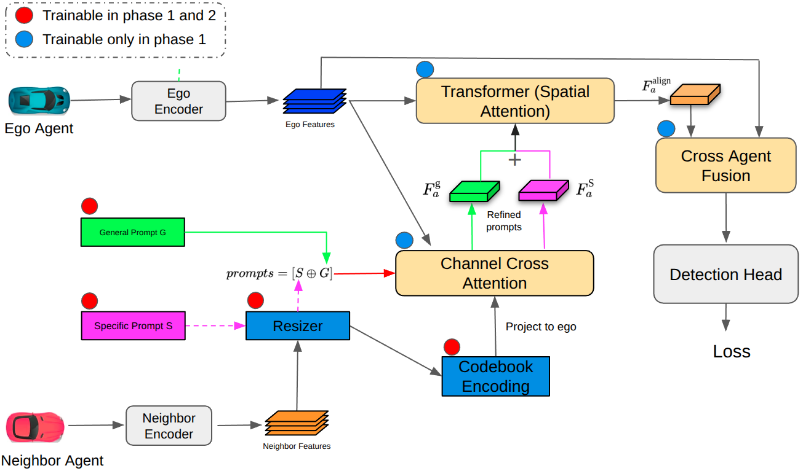

This is the official implementation of MDPI2025 paper ["Extensible Heterogeneous Collaborative Perception in
Autonomous Vehicles with Codebook Compression"]().


## Installation
This repo is mainly based on the cooperative detection framework OpenCOOD and Polyinter(https://github.com/yuchen-xia/PolyInter/) and CodeFilling (https://github.com/PhyllisH/CodeFilling) repositories. Therefore, the installations are the same.

```
# Clone repo
git clone https://github.com/Babak-Ebrahimi/PolyCode.git

# Setup conda environment
conda create -y --name PolyCode python=3.7

conda activate PolyCode

# Install torch
pip install torch==1.13.1+cu117 torchvision==0.14.1+cu117 torchaudio==0.13.1 --extra-index-url https://download.pytorch.org/whl/cu117

# spconv install
pip install spconv-cu117

# Install dependencies
pip install -r requirements.txt

# Install bbx nms calculation cuda version
python opencood/utils/setup.py build_ext --inplace

# install opencood into the environment
python setup.py develop
```

## Data Downloading
All the data (train-003.zip, validate-002.zip, test-012.zip, additional-001.zip) can be downloaded from [google drive](https://ucla.app.box.com/v/UCLA-MobilityLab-OPV2V). 
```
PolyCode
├── dataset # the downloaded opv2v data
│   ├── train
│   ├── validate
│   ├── test
│   ├── additional
├── opencood # the core codebase
```

## PolyCode Stage1 Training
First, train the single agent's encoder and detection head. The training process can refer to the [OpenCOOD](https://github.com/DerrickXuNu/OpenCOOD) process. 

Then execute the following command to start Stage1 training:
```
python opencood/tools/train.py --hypes_yaml ${CONFIG_FILE} [--model_dir  ${CHECKPOINT_FOLDER} --half]
```
For example​​, when training with three agent types in Stage1 (pp8 (ego), vn4, pp4), execute the command:
```
cd /media/babak/0bbeca15-45b5-4516-aa80-b282064bdd77/PolyCode
export PYTHONPATH=$(pwd)
python opencood/tools/train.py --hypes_yaml opencood/hypes_yaml/PolyCode_stage1/stage1_pp8_vn4_pp4_fcooper_opv2v.yaml
```

The trained Stage1 model files will be saved in `checkpoints`.

To test the trained Stage1 model, execute the following command to start inference:
```
python opencood/tools/inference.py --model_dir ${CHECKPOINT_FOLDER}
```
For example​​, when training with three agent types in Stage1 (pp8 (ego), vn4, pp4), execute the command
```
python opencood/tools/inference.py --model_dir checkpoints/stage1_pp8_vn4_pp4_fcooper_opv2v_2025_12_07_22_25_03/
```
## PolyCode Stage2 Training
Execute the following command to start Stage2 training:
```
python opencood/tools/train.py --hypes_yaml ${CONFIG_FILE} [--model_dir  ${CHECKPOINT_FOLDER} --half]
```
For example, when training in Stage2 with pp8 (ego) and sd1 (neighbor), while using a Stage1 model trained on pp8, vn4, pp4, execute the command:  
```
python opencood/tools/train.py --hypes_yaml opencood/hypes_yaml/PolyCode_stage2/stage2_pp8_sd1__pp8_vn4_pp4_fcooper_opv2v.yaml
```

The trained Stage2 model files will be saved in `checkpoints`.

To test the trained Stage2 model, execute the following command to start inference:
```
python opencood/tools/inference.py --model_dir ${CHECKPOINT_FOLDER}
```
For example: 
```
python opencood/tools/inference.py --model_dir checkpoints/stage2_pp8_sd1__pp8_vn4_pp4_fcooper_opv2v_2025_12_07_23_57_11/
```
